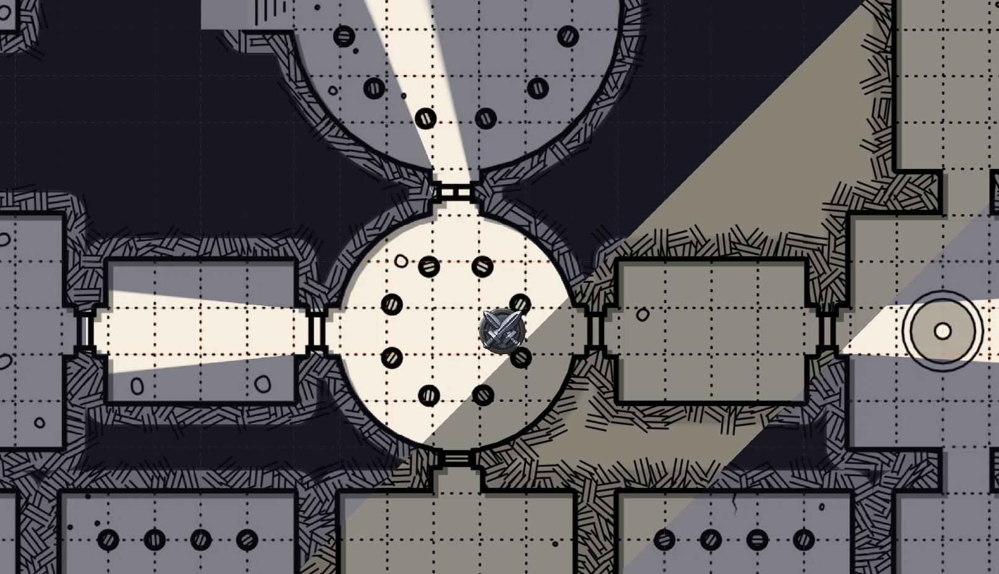
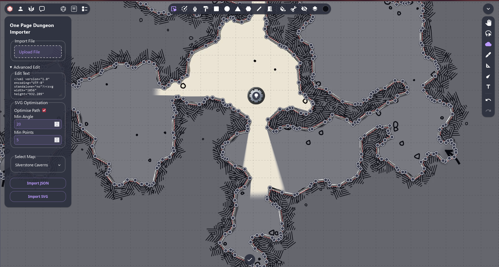
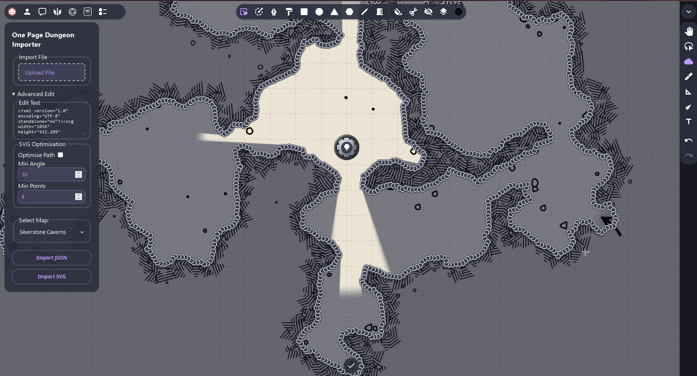

# One Page Importer

Extension for owlbear rodeo
Import Maps from Watabous' One Page Dungeon using his JSON export. Features integration with Dynamic Fog's Door Mechanic. 
  - allows for offset for a given map in the scene
  - imports both rectangles and round rooms
  - imports doors, and will open doors that are shown as open
  - Imports secret doors, with 2 door segments shown

Also, can import Caves via 'import SVG' button. same procedure as JSON import. Glaives do not work and likely won't. If you want glaives, export SVG from the cave version and use that.

  TODO: 

  - add user-editable variables
  - modify door logic to allow for doors at 1/4 positions
  - import certain props for fog blocking (columns, for example)
  - ~~Some corridors have doors throughout (Likely his logic), remove these from importing automatically~~ shouldn't be an issue, as such "doors" are now imported as pre-opened

## Video

https://github.com/user-attachments/assets/93d7c20f-6865-4906-9396-dec662087685

## Installation

manifest file: `https://enderpy.github.io/one-page-importer/manifest.json`

## how to use (Dungeon / JSON mode)

1. generate a map on https://watabou.github.io/cave-generator (can also configure using right click -> tags)
2. right click -> export -> PNG for the map, and JSON for the data. note the DPI when exporting PNG
3. Add the map as normal into Owlbear (drag into the scene as a map, or asset manager > maps > add). You may need to configure the DPI to match
4. On the action bar (top left), open "One Page Importer" and either click `browse` > select JSON file or paste the content from the JSON under Advanced.
5. Select the relevant map, or 'No Offset' for default positioning, then `Import JSON`. Fog of war should apply over the map.
  - note: if you cant see any doors, see if you haven't added a dynamic Fog of War extension (either `https://dynamic-fog.owlbear.rodeo/manifest.json`, `https://owlbear-chromodynamic-fog.nicholassdesai.workers.dev/manifest.json` are recommended)

note: for caves, same procedure, except export as SVG from cave-generator, and click `import SVG`

thanks to watabou for his amazing tool and source for this project, https://watabou.github.io/one-page-dungeon/

## Advanced

### SVG Optimisation

This function, enabled by default, can significantly improve performance
Enabled:

 - Min Angle: 
   - The angle of which must be met. Biggest imapact on performance. Accepts values between 0 and 179
   - Recommended value of at least 5 for moderate performance increase with next to zero cosmetic difference, default is 20, if low performance adjust this first.
 - Min Points:
   - The minimum number of points skipped before forcing one to be added. Accepts values between 0 and 99. Zero disables this check
   - Recommended minimum of 4 for performance, default 5. mostly affects large curves where angle might not account for difference. setting this to 1 is equivelant to disabling optimisation, so not recommended.

Additional performance gains:
 - Adjusting Generator Geometry
  - on generator, right click > shape > geometry, 
  - Irregularity:
    - slightly adjusts shape of the cave on a large scale
  - Bumpiness:
    - adjusts how curvy (like a wave) the walls on a medium scale
  - Roughness:
    - increases sharpness of walls on a small scale
  - For best performance, 0 Irregularity, 0 Bumpiness and ~0 Irregularity with 30 Angle and 10 Points should provide the least quantity of points
  - For a balance of cosmetics and performance, 0/0/0.4 with 20-30 Angle and 5-10 points should reduce the number of visual artifacts
  - For great cosmetics and good performance, use any geometry, with 10 Angle and 5 points
  - For best cosmetics but still optimised, use 5 angle 5 points
  - If you require absolute precision, disable optimisation (not recommended)

A note on increasing cosmetics:
 - if using high-performance profiles, you can adjust Owlbears' Fog Style - Line thickness. 
  - Default optimisation works well with width 5-6 to cover entire wall.
  - Adjust fog width as needed for higher performance profiles 
 - High performance profiles may want to change the Cave Shadow Inner distance (right click - style - Shadow) from 1 to either 0 or 2-3 as it is commonly clipped from the SVG optimisation